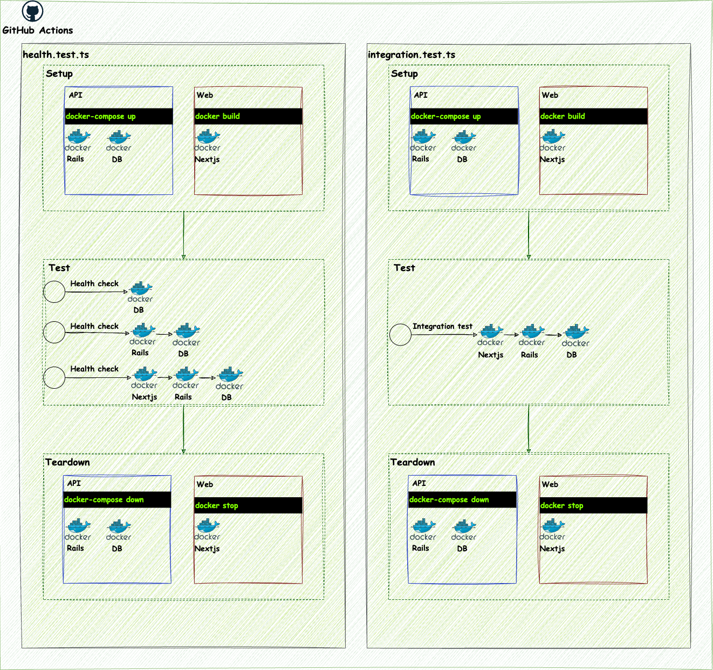

## testcontainers-rails-nextjs

A project that demonstrates end-to-end testing of a Rails API and Next.js web application using Testcontainers, Playwright, and Vitest.



### Features

- **Dockerized Rails API** with MySQL database.
- **Next.js Frontend** running in a Docker container.
- **End-to-End Testing** using Playwright for frontend interactions and Vitest for test orchestration.
- **Database Verification** via SQL queries executed within MySQL container.
- **Testcontainers Integration** for seamless container orchestration during tests.

### Structure

- **`setupApiContainer`**: Configures and starts the Rails API and MySQL containers.
- **`setupWebContainer`**: Builds and starts the Next.js container.
- **Tests**:
  - **`health.test.ts`**: Verifies the setup and health of API, DB, and Web containers.
  - **`todo-app.test.ts`**: Tests CRUD operations on a Todo application.

### How to Run

1. Ensure you have Docker installed and running.
2. Install dependencies:

```bash
cd e2e
npm install
```

3. Run the tests:

```bash
npm run test
```

### Example Tests

- Health Check:
  - Verifies the existence of the database and tables in MySQL.
  - Validates API responses.
  - Confirms page titles using Playwright.
- Todo App:
  - Adds, toggles, and deletes todo items.
  - Persists data after reload.

### Requirements

- Docker
- Node.js (22+ recommended)

### Technologies Used

- Docker Compose for multi-container orchestration.
- Testcontainers for managing container lifecycles during tests.
- Playwright for browser automation.
- Vitest for test execution and assertions.

### Notes

Each test is isolated, with separate containers for API and Web.
Tests can be run locally or in CI/CD environments like GitHub Actions.
